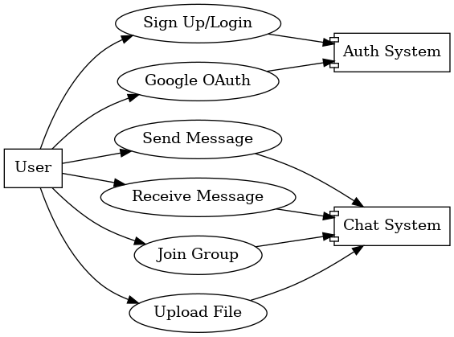
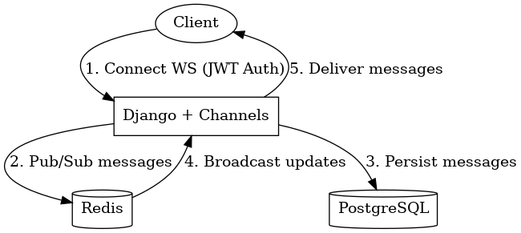
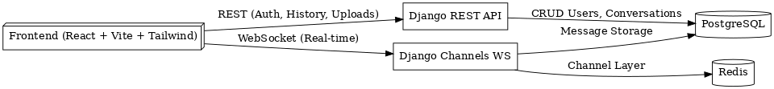

# LiveWire System Architecture

## Overview
LiveWire is a **real-time chat application** built using Django (backend) and React (frontend).  
It supports one-to-one and group messaging with WebSockets.

## Components
- **Frontend:** React (Vite) + Tailwind.
- **Backend:** Django + DRF + Channels.
- **Database:** PostgreSQL (persistent storage).
- **Channel Layer:** Redis (WebSocket scaling).

## Diagrams

### 1. Use Case Diagram

### 2. Entity Relationship Diagram (ERD)

### 3. WebSocket Flow

### 4. High-Level Architecture

## Flow Summary
1. User authenticates via JWT or Google OAuth.
2. Frontend establishes WebSocket connection with JWT.
3. Messages are published to Redis channel layer.
4. Django Channels consumes messages, persists to PostgreSQL.
5. Updates broadcast back to connected clients in the conversation room.
